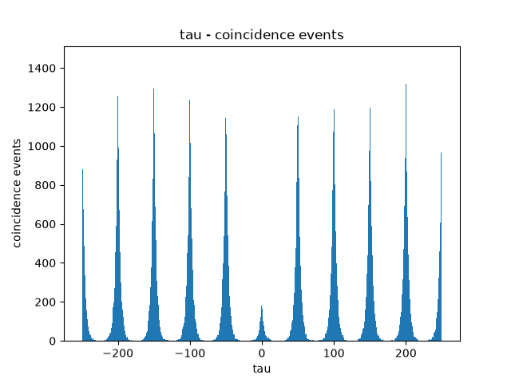

JIT compiled Monte Carlo simulation of the [Hanbury Brown & Twiss experiment](https://mpl.mpg.de/fileadmin/user_upload/Chekhova_Research_Group/Lecture_5_3.pdf), using a pair of nitrogen vacancy centers and lasers (to simulate probabilistic double, single, zero photon emission per pulse). The result is the second order correlation function at $\tau$ = 0 for each seed and efficiency pair.

